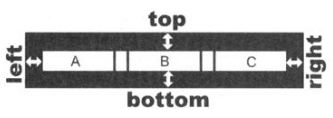

**Менеджеры компоновки** (layout managers) представляют возможности для горизонтального, вертикального и табличного размещения виджетов, в том числе и встроенных компоновок. Это означает, что в компоновку вы можете добавить и виджет, и другую компоновку. С помощью этого вы можете собирать компоновки практически любой сложности.

Менеджеры удобны тем, что он сам присваивает виджет-предка помещаемым внутрь себя объектам. Таким образом утечки памяти (memory leak) **не произойдет**. 

**Основные классы** менеджеров компоновки

* `QLayout` - абстрактный класс, унаследованный от `QObject` и `QLayouytItem`
* `QGridLayout` - наследник `QLayout`, управляет табличным размещением
* `QBoxLayout` - наследник `QLayout`, управляет линейным размещением
* `QHBoxLayout` - наследник `QBoxLayout`, размещает виджеты горизонтально
* `QVBoxLayout` - наследник `QBoxLayout`, размещает виджеты вертикально

**Основные методы** 

- `setSpacing()` - устанавливает расстояние между виджетами, принимает количество пикселей
- `setContentMargins()` - устанавливает отступ виджетов от границ сторон компоновки (left, top, bottom, right)
- `addWiddget()` - добавляет виджет в компоновку
- `addLayout()` - добавляет встроенный менеджер компоновки
- `removeWidget()` - удаляет виджет через указатель на него



**Пример кода**
```
#include <QtWidgets>

int main(int argc, char **argv) {
   // Application setup
   QApplication app(argc, argv);
	QWidget wgt;
	
	// Buttons setup
	QPushButton *pcmd_a = new QPushButton("Click me");
	QPushButton *pcmd_b = new QPushButton("Not, me!");
	
	// Layout setup
	QBoxLayout *pbxLayout = new QBoxLayout(QBoxLayout::LeftToRight);
	// or more elegant:
	// QHBoxLayout *pbxLayout = new QHBoxLayout();
	pbxLayout->setContentsMargins(10, 10, 10, 10);
	pbxLayout->addWidget(pcmd_a);
	pbxLayout->addWidget(pcmd_b);
	// Set layout to widget
 	wgt.setLayout(pbxLayout);
	
	// Show widget
	wgt.resize(400, 40);
	wgt.show();
	
	// End of program
	return app.exec();
}
```

**Табличное размещение QGridLayout** 
Для табличного размещения служит класс `QGridLayout`. Таблица состоит из ячеек, позиции которых задаются строками и столбцами.

Если нужна таблица из двух столбцов, то можно воспользоваться классом `QFormLayout`, он помогает реализовать более компактный код

**Пример кода**
```
#include <QtWidgets>

int main(int argc, char **argv) {
	QApplication app(argc, argv);
	QWidget wgt;
	
	// Создание кнопок
	QPushButton *pcmdA = new QPushButton("A");
	QPushButton *pcmdB = new QPushButton("B");
	QPushButton *pcmdC = new QPushButton("C");
	QPushButton *pcmdD = new QPushButton("D");
	
	// Создать компоновку
	QGridLayout *pgrdLayout = new GridLayout();

	// Устаналиваем отступы от границы в пикселях от всех сторон
	pgrdLayout->setContentsMargins(5, 5, 5, 5);
	// Установить расстояние в 15 пикселей между виджетами
	pgrdLayout->setSpacing(15);

	// Добавить виджеты в компоновку
	pgrdLayout->addWidget(pcmdA, 0, 0);
	pgrdLayout->addWidget(pcmdB, 0, 1);
	pgrdLayout->addWidget(pcmdC, 1, 0);
	pgrdLayout->addWidget(pcmdD, 1, 1);
	
	// Установить компоновку
	wgt.setLayout(pgrdLayout);
	
	// Отобразить виджет
	wgt.show();

	return app.exec();
```